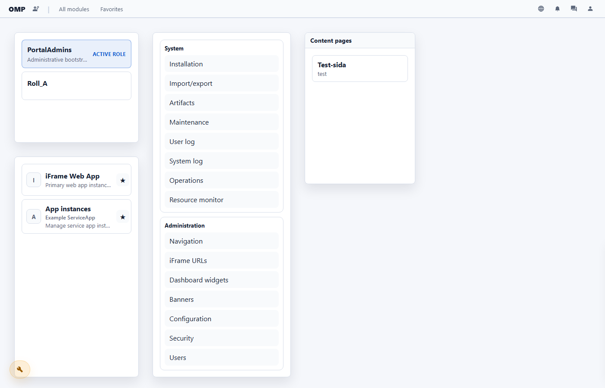
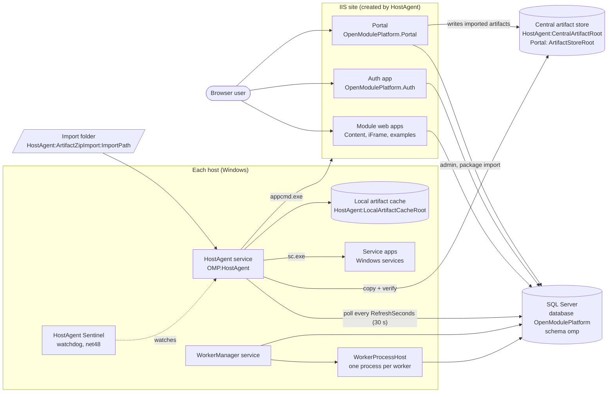
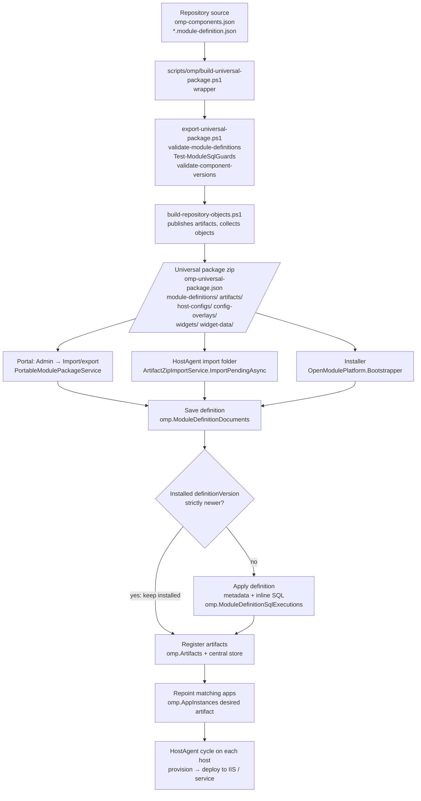
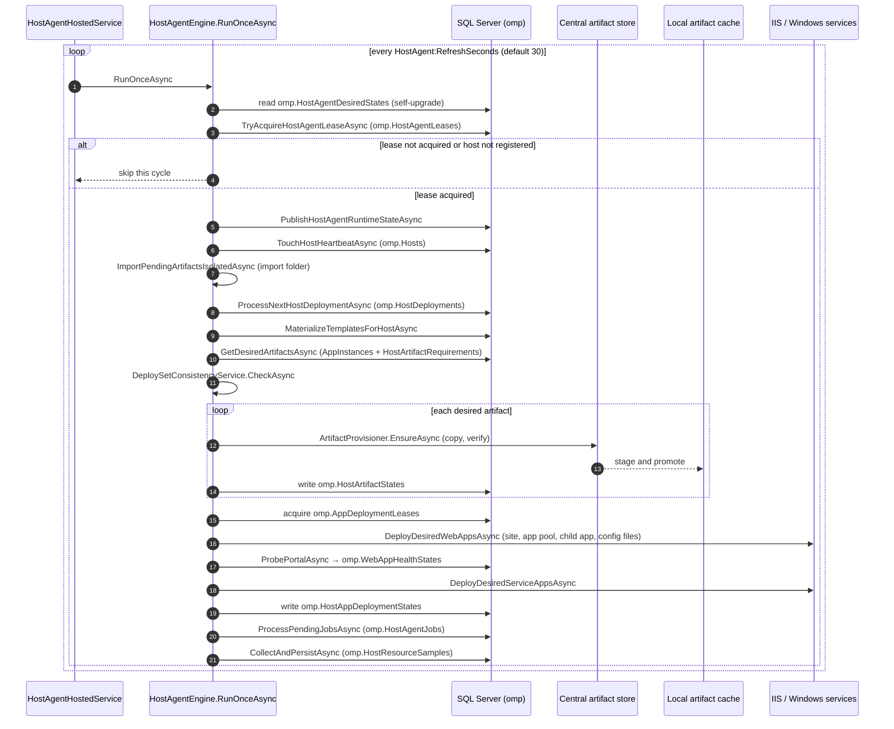
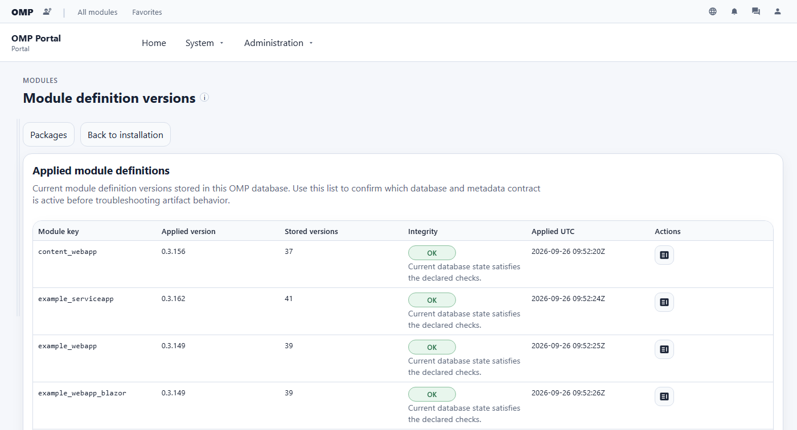
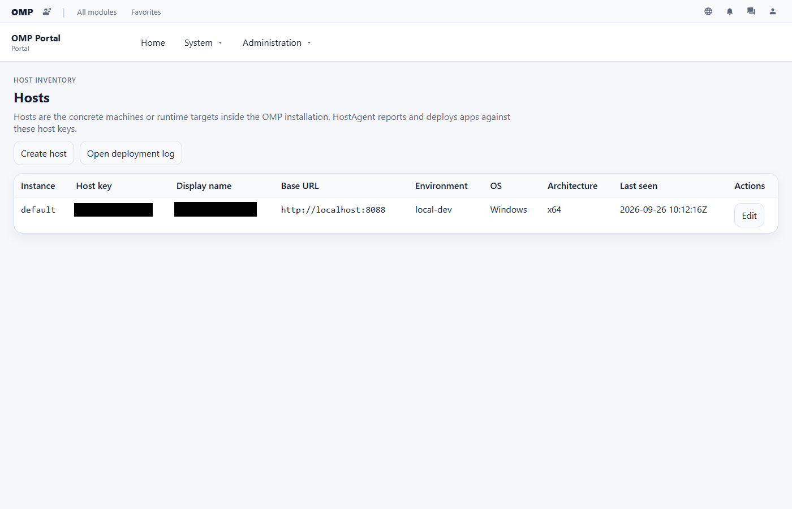
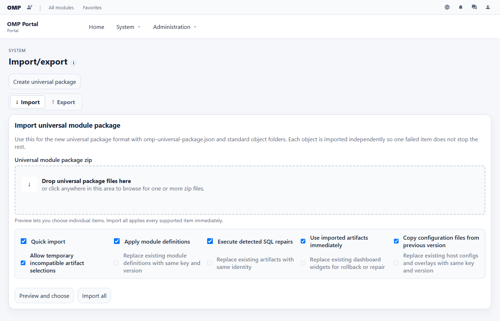
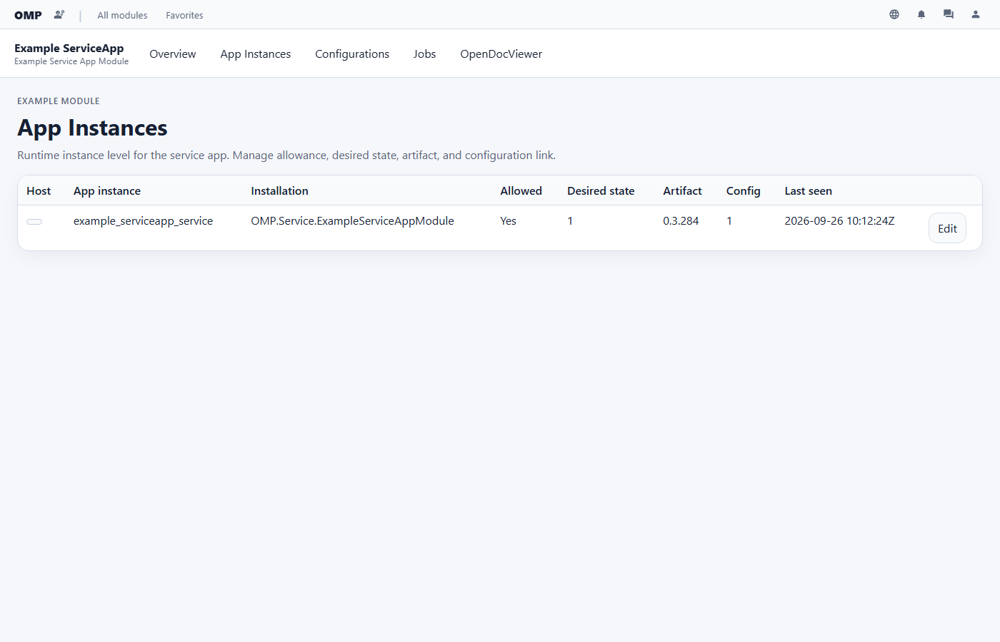

# OpenModulePlatform

OpenModulePlatform (OMP) is a .NET 10 platform for Windows that installs, runs,
and administers modules — IIS web apps, Windows services, and plugin workers —
from versioned packages, with SQL Server as the single source of desired and
observed state.

[](https://github.com/Optimal2/OpenModulePlatform/actions/workflows/ci.yml)
[](LICENSE)




## What it is

- **A Portal** (`OpenModulePlatform.Portal`, Razor Pages) where you administer
  instances, hosts, modules, module definitions, artifacts, app instances, RBAC,
  configuration, and imports/exports of packages.
- **A HostAgent** (`OpenModulePlatform.HostAgent.WindowsService` +
  `OpenModulePlatform.HostAgent.Runtime`) — a Windows service on each host that
  polls the database, copies artifacts from a central store into a local cache,
  and deploys them: web apps as IIS sites, application pools and child
  applications (through `appcmd.exe`), service apps as Windows services
  (through `sc.exe`).
- **A package format.** A *universal package* is a zip with an
  `omp-universal-package.json` manifest and folders of module definitions,
  artifact zips, host configs, config overlays, and dashboard widgets. The
  Portal, the HostAgent import folder, and the installer all read it.
- **Module definitions.** A versioned JSON document per module
  (`*.module-definition.json`) that carries the module's metadata, its SQL
  (embedded with a SHA-256), and its artifact compatibility. Applying a
  definition is gated on `definitionVersion`.
- **A worker runtime** (`OpenModulePlatform.WorkerManager.WindowsService`,
  `OpenModulePlatform.WorkerProcessHost`, `OpenModulePlatform.Worker.Abstractions`)
  that runs one child process per worker app instance and loads a plugin into it.
- **First-party modules** that are usable as-is: the shared sign-in app
  (`OpenModulePlatform.Auth`, Windows/AD and local password), content pages
  (`OpenModulePlatform.Web.ContentWebAppModule`) and iframe embedding
  (`OpenModulePlatform.Web.iFrameWebAppModule`).
- **Four example modules** under `examples/`: a plain web app, a Blazor web
  app, a web app with a Windows service, and a web app with a plugin worker.

## What it is not

- Not cross-platform. HostAgent deployment uses IIS and the Windows service
  control manager; the installer (`OpenModulePlatform.Bootstrapper`) targets
  `net10.0-windows`.
- Not a container orchestrator. There are no containers; a *host* is a Windows
  machine registered in `omp.Hosts`.
- Not a finished product. The repository is on the `0.3.x` line
  ([SECURITY.md](SECURITY.md) lists what is supported); treat it as a baseline
  you evaluate and harden, not as turnkey production software.
- Not a place for customer code. The repository holds neutral platform core,
  example modules, and a few first-party module hooks: dashboard widgets in the
  Portal that read the tables of first-party modules maintained outside this
  repository. Each hook checks that its module's tables exist and renders an
  empty widget when they do not, so the Portal runs without those modules.

## Architecture



Derived from: `OpenModulePlatform.Portal/Program.cs` and `appsettings.json`
(`ConnectionStrings:OmpDb`, `ArtifactStoreRoot`);
`OpenModulePlatform.HostAgent.WindowsService/Program.cs` and `appsettings.json`
(`HostAgent:RefreshSeconds`, `CentralArtifactRoot`, `LocalArtifactCacheRoot`,
`ArtifactZipImport`); `HostAgent.Runtime/Services/WebAppDeploymentService.cs`
(`EnsureIisSite`, `EnsureAppPool`, `EnsureIisChildApplication`),
`IisAppCmd.cs`, `WindowsServiceControl.cs`, `ServiceAppDeploymentService.cs`;
`OpenModulePlatform.HostAgent.Sentinel/SentinelSettings.cs`;
`docs/ARCHITECTURE.md` (WorkerManager/WorkerProcessHost).

### The data model in one paragraph

Definitions (`omp.Modules`, `omp.Apps`, `omp.Artifacts`) are separate from
concrete instances (`omp.ModuleInstances`, `omp.AppInstances`). An
`AppInstance` is the central runtime row: it names the host, the artifact
version, the configuration, the route or URL, and the desired state, and the
host writes back observed state and heartbeat. The Portal builds its app
catalogue from `AppInstances`. HostAgent records what it provisioned in
`omp.HostArtifactStates` and what it deployed in `omp.HostAppDeploymentStates`.
See [docs/ARCHITECTURE.md](docs/ARCHITECTURE.md) and
[docs/TERMINOLOGY.md](docs/TERMINOLOGY.md).

## Package flow: from source to a running app



Derived from: `scripts/omp/build-universal-package.ps1`,
`scripts/omp/export-universal-package.ps1`,
`scripts/omp/build-repository-objects.ps1`,
`OpenModulePlatform.Artifacts/UniversalModulePackageReader.cs`,
`OpenModulePlatform.Portal/Services/PortableModulePackageService.cs`
(`ImportUniversalPackageUploadAsync`),
`HostAgent.Runtime/Services/ArtifactZipImportService.cs`
(`ImportPendingAsync`, `ImportModuleDefinitionAsync`,
`ExecuteModuleDefinitionSqlAsync`),
`HostAgent.Runtime/Services/OmpHostArtifactRepository.cs`
(`SaveImportedModuleDefinitionAsync`,
`ApplyImportedArtifactToMatchingApplicationsAsync`),
`OpenModulePlatform.Bootstrapper/Program.cs` (`RunBootstrapAsync`), and
[docs/UNIVERSAL_MODULE_PACKAGES.md](docs/UNIVERSAL_MODULE_PACKAGES.md).

Two rules follow from the version gate. A module-definition change that alters
SQL must bump `definitionVersion` in the same commit; otherwise an import skips
the new SQL. And a package with an older definition than the one installed does
not downgrade it — it only fills in missing compatible objects (see
[AGENTS.md](AGENTS.md) and [docs/MODULE_DEFINITIONS.md](docs/MODULE_DEFINITIONS.md)).

## One HostAgent cycle



Derived from: `OpenModulePlatform.HostAgent.WindowsService/Services/HostAgentHostedService.cs`
(`ExecuteAsync`), `OpenModulePlatform.HostAgent.Runtime/Services/HostAgentEngine.cs`
(`RunOnceAsync`), `Models/HostAgentSettings.cs` (`RefreshSeconds = 30`,
`MaterializeTemplates`, `ProcessHostDeployments`, `ProcessHostAgentJobs`),
`ArtifactProvisioner.cs`, `WebAppDeploymentService.cs`,
`WebAppHealthMonitor.cs`, `ServiceAppDeploymentService.cs`,
`HostAgentJobProcessor.cs`, `HostResourceCollector.cs`. The diagram leaves out
self-upgrade takeover, quiesce, and file mirroring; system-log pruning
(`SystemLogRetentionService`) and maintenance scans (`MaintenanceScanScheduler`)
run as separate hosted services, not in this loop. Details:
[docs/HOST_AGENT.md](docs/HOST_AGENT.md).

## What it looks like

Screenshots from a local development installation (light theme, 1400×900).
Rows and tiles that belong to non-public modules were removed from the page
before capture, and the host name is blacked out.

| | |
| --- | --- |
|  |  |
| **Admin → Module definitions** — applied definition version, stored versions and integrity per module. | **Admin → Hosts** — registered hosts and when HostAgent last reported. |
|  |  |
| **System → Import/export** — upload a universal package; preview or import all, with per-object options. | **A module page** — the example service app's app instances: desired state, artifact version, heartbeat. |

## Quick start (local, one Windows machine)

Requirements, all checked by the code rather than by convention:

- Windows with IIS (HostAgent looks for `%WINDIR%\System32\inetsrv\appcmd.exe`)
  and the ASP.NET Core hosting bundle — see
  [docs/HOSTING_WINDOWS_IIS.md](docs/HOSTING_WINDOWS_IIS.md).
- SQL Server (a local default instance works).
- .NET SDK `10.0.400` or a later feature band (`global.json`,
  `rollForward: latestFeature`).
- An account allowed to create IIS sites and Windows services.

The supported path is the HostAgent-first installer:

1. Copy `installer/hosts/sample/bootstrap.json` to a folder for your machine
   (or edit it) and set `profile.machineNames`, the SQL server/database, the
   bootstrap Portal administrator principal, and the paths under `hostAgent`
   (defaults: service `OMP.HostAgent`, IIS site `OpenModulePlatform` on port
   `8088`, artifact store `ArtifactStore` and cache `ArtifactCache` under the OMP root on drive C).
2. Build the installer runner:
   ```powershell
   .\scripts\deployment\update-installer-runner-only.ps1 -PackageRoot .\installer
   ```
3. Start `.\installer\OpenModulePlatform.Bootstrapper.exe` and keep
   *Refresh installer package from source first* enabled. The installer runs
   the core SQL, imports the module definitions, copies artifacts into the
   store, registers them, installs the HostAgent service, and runs one
   HostAgent cycle (`--run-once`). HostAgent then deploys the Portal, Auth and
   the other apps.
4. Open `http://localhost:8088/` and sign in with the principal from step 1.

Step-by-step detail: [installer/README.md](installer/README.md) and
[docs/HOST_AGENT_FIRST_INSTALL.md](docs/HOST_AGENT_FIRST_INSTALL.md).

### Manual SQL install (without the installer)

Every SQL folder follows the same pattern: `0-validate-*.sql` is a read-only
probe, `1-setup-*.sql` creates schema, `2-initialize-*.sql` registers data. Run,
in order:

```text
sql/1-setup-openmoduleplatform.sql
sql/2-initialize-openmoduleplatform.sql
OpenModulePlatform.Portal/sql/1-setup-omp-portal.sql
OpenModulePlatform.Portal/sql/2-initialize-omp-portal.sql
```

Set `@BootstrapPortalAdminPrincipal` in both `2-initialize` scripts. Add the
first-party modules (`OpenModulePlatform.Web.ContentWebAppModule/Sql/`,
`OpenModulePlatform.Web.iFrameWebAppModule/Sql/`) and any
`examples/<module>/sql/` scripts you want. See [sql/README.md](sql/README.md).

## Configuration

| Setting | Where | Meaning |
| --- | --- | --- |
| `ConnectionStrings:OmpDb` | Portal, Auth, HostAgent, WorkerManager `appsettings.json` | The OMP database. |
| `ArtifactStoreRoot` | Portal | Central artifact store used by Portal import/export. |
| `HostAgent:HostKey` | HostAgent | Row in `omp.Hosts` this agent acts for. |
| `HostAgent:RefreshSeconds` | HostAgent | Poll interval, default `30`. |
| `HostAgent:CentralArtifactRoot` / `LocalArtifactCacheRoot` | HostAgent | Artifact source and per-host cache; both required. |
| `HostAgent:ArtifactZipImport` | HostAgent | Import folder (`IsEnabled`, `ImportPath`, `ProcessedPath`, `FailedPath`). Off by default. |
| `HostAgent:SystemLogRetentionDays` | HostAgent | Pruning of `omp.SystemLog`, default 90. |

Runtime configuration files (`appsettings*.json`) are not part of artifact
payloads; they are stored as artifact configuration-file rows or host-specific
config overlays so configuration changes do not change artifact hashes. See
[docs/CONFIG_OVERLAYS.md](docs/CONFIG_OVERLAYS.md) and
[docs/ADMIN_CONFIGURATION.md](docs/ADMIN_CONFIGURATION.md).

## Security

Authentication is handled by the shared Auth app (Windows/AD or local
password); authorization is RBAC stored in `omp` and administered in the Portal
([docs/AUTHENTICATION_AND_RBAC.md](docs/AUTHENTICATION_AND_RBAC.md)). Web apps
send a Content Security Policy
([docs/CONTENT_SECURITY_POLICY.md](docs/CONTENT_SECURITY_POLICY.md)).
Report vulnerabilities privately as described in [SECURITY.md](SECURITY.md).

## Repository layout

| Path | Contents |
| --- | --- |
| `OpenModulePlatform.Portal` | Portal (Razor Pages), its SQL under `sql/` |
| `OpenModulePlatform.Auth` | Shared sign-in app |
| `OpenModulePlatform.HostAgent.*` | HostAgent service, runtime library, Sentinel watchdog, tests |
| `OpenModulePlatform.WorkerManager.WindowsService`, `WorkerProcessHost`, `Worker.Abstractions` | Worker runtime |
| `OpenModulePlatform.Web.Shared` (+ `.Analyzers`) | Shared web infrastructure for the Portal and modules |
| `OpenModulePlatform.Web.ContentWebAppModule`, `Web.iFrameWebAppModule` | First-party modules |
| `OpenModulePlatform.Artifacts` | Package and manifest readers shared by Portal, HostAgent and installer |
| `OpenModulePlatform.Bootstrapper` | Installer (GUI and command line) |
| `OpenModulePlatform.EventPublisher.*` | Push-event outbox (`omp.push_event_outbox`) |
| `examples/` | Four example modules |
| `sql/` | Core schema and bootstrap data |
| `installer/` | Sample installer profile |
| `scripts/omp/` | Package build, validation and version tooling |
| `omp-components.json` | Component manifest: `repositoryVersion` and per-component versions |
| `*.module-definition.json` | Module definitions (for example `omp_core.module-definition.json`) |

## Versions

`omp-components.json` is the version source: `repositoryVersion` is bumped on
every push by `scripts/omp/push-with-rebump.ps1`, and each deployable component
(Portal, Auth, HostAgent, Sentinel, WorkerManager, WorkerProcessHost, the
modules) has its own version. Bump with `scripts/omp/bump-version.ps1`. The
assembly version in `Directory.Build.props` is intentionally static. Release
history: [CHANGELOG.md](CHANGELOG.md); versioning policy:
[docs/VERSIONING_AND_IDENTITIES.md](docs/VERSIONING_AND_IDENTITIES.md) and
[docs/OMP_COMPONENT_MANIFEST.md](docs/OMP_COMPONENT_MANIFEST.md).

## Development and tests

```powershell
dotnet build OpenModulePlatform.slnx --configuration Release
dotnet test  OpenModulePlatform.slnx --configuration Release
```

- Tests use xUnit. Most are in-memory. Database-backed tests need a local SQL
  Server (LocalDB is enough), read `OMP_TEST_CONNECTION_STRING`, and create and
  drop their own databases.
- Tests excluded from the CI gate, and why, are listed in
  [docs/TEST_DEBT.md](docs/TEST_DEBT.md).
- `OpenModulePlatform.UiTests` runs Playwright invariant scans (overflow,
  invisible text, zero-size targets, CSP) against the built Portal, Auth and
  iFrame apps. It is excluded from CI (`Category!=Ui`); run it with
  `dotnet test OpenModulePlatform.slnx -c Release --no-build --filter "Category=Ui"`.
  Missing prerequisites make the tests skip with a reason — a skipped UI test
  is not a passing one.

### Local CI gate

`scripts/local-ci.ps1` runs the same checks as CI: module-definition
validation, module SQL guards, component-version validation, PSScriptAnalyzer,
the Pester suites under `tests/`, the Release build, and the seven non-UI test
projects with a zero-execution check. Activate the tracked git hooks once per
clone so it runs on `git push`:

```powershell
.\scripts\setup-hooks.ps1
```

The pre-commit hook only checks that `omp-components.json` is valid JSON and
that staged `.ps1` files contain no tabs. A green local gate does not guarantee
a green CI run; check the [CI workflow](https://github.com/Optimal2/OpenModulePlatform/actions/workflows/ci.yml)
after pushing. More: [CONTRIBUTING.md](CONTRIBUTING.md) and
[docs/CODEX_DEVELOPMENT.md](docs/CODEX_DEVELOPMENT.md).

## Documentation

Start with [docs/README.md](docs/README.md), the full index. The most used
pages:

- [Architecture](docs/ARCHITECTURE.md) · [Terminology](docs/TERMINOLOGY.md)
- [HostAgent](docs/HOST_AGENT.md) · [HostAgent-first install](docs/HOST_AGENT_FIRST_INSTALL.md)
- [Module definitions](docs/MODULE_DEFINITIONS.md) · [Artifact packages](docs/ARTIFACT_PACKAGES.md) · [Universal packages](docs/UNIVERSAL_MODULE_PACKAGES.md)
- [Worker runtime](docs/WORKER_RUNTIME.md) · [Push events](docs/PUSH_EVENTS.md) · [Logging](docs/LOGGING.md)
- [Authentication and RBAC](docs/AUTHENTICATION_AND_RBAC.md) · [Hosting on Windows and IIS](docs/HOSTING_WINDOWS_IIS.md)
- [Project status](docs/PROJECT_STATUS.md) · [Architecture decisions](docs/adr/)

## License

MIT — see [LICENSE](LICENSE).
